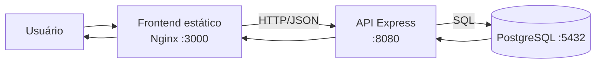
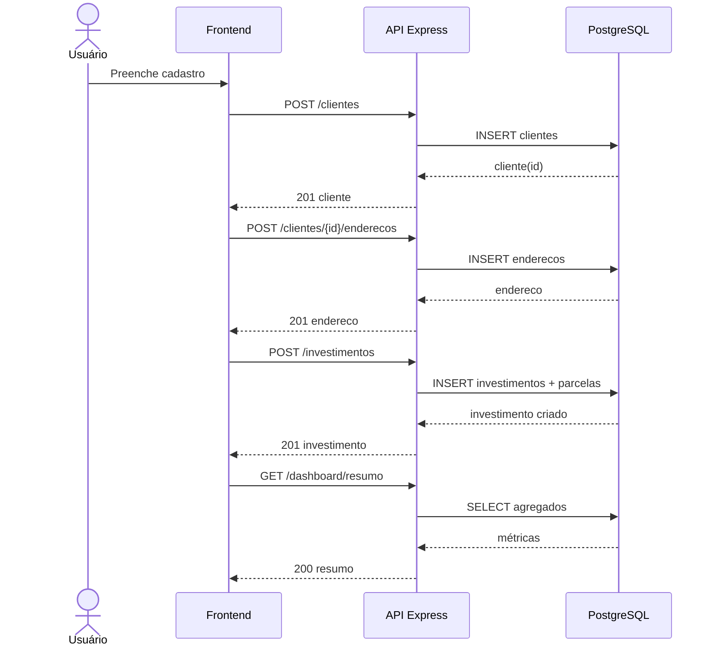
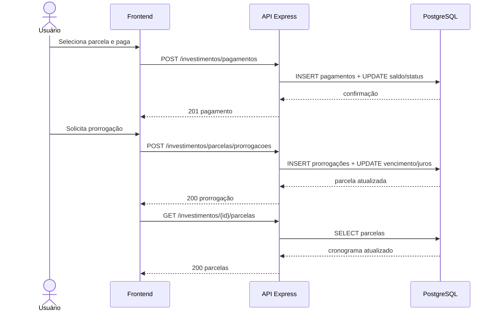
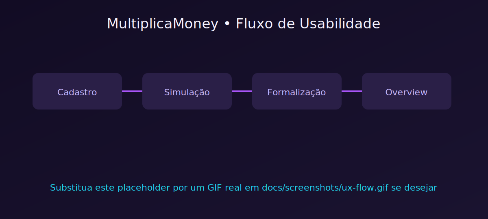
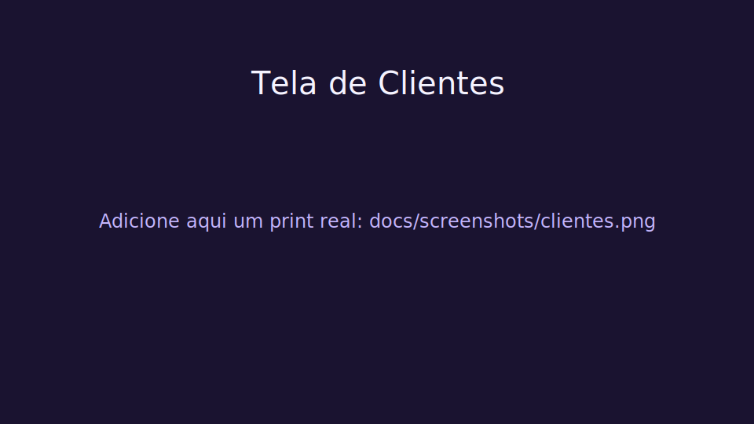
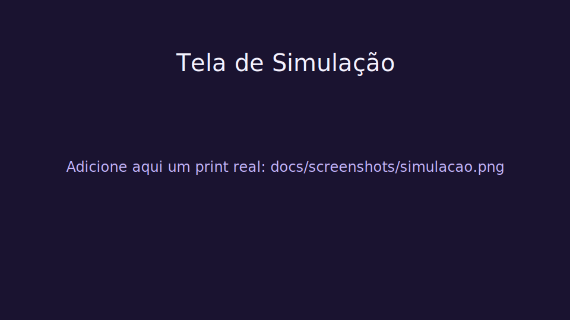
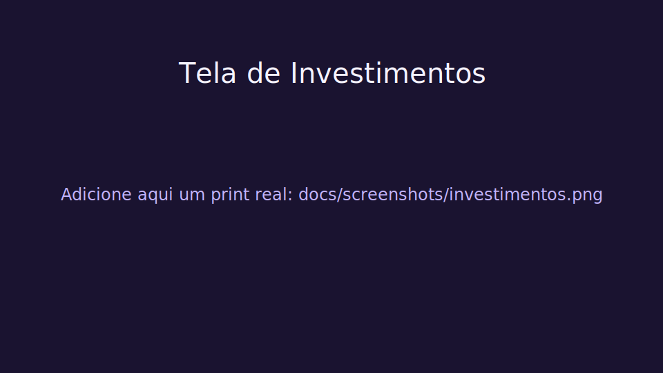
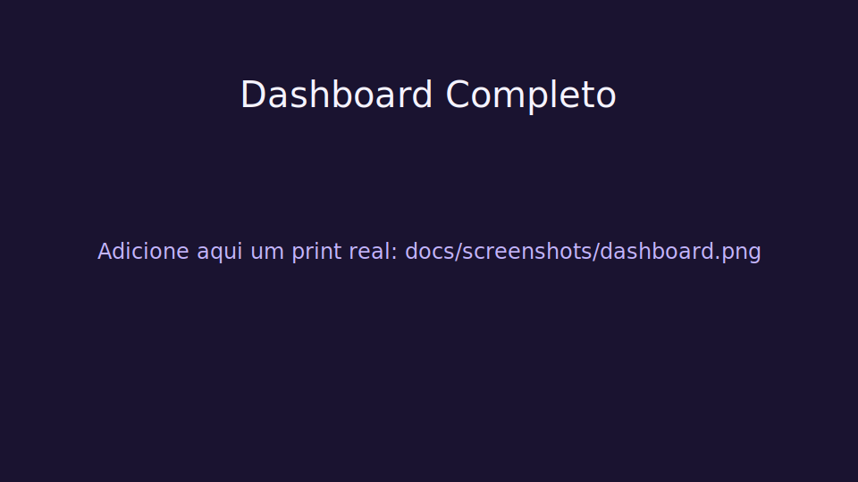

# MultiplicaMoney

Projeto MultiplicaMoney com backend, frontend estático e frontend React.

## Descrição do sistema

O MultiplicaMoney é um sistema de gestão de clientes e investimentos, focado em simulação, contratação e acompanhamento financeiro. A plataforma permite cadastrar clientes e endereços, simular cenários de investimento com cálculo de juros simples e compostos, formalizar investimentos com parcelamento, registrar pagamentos e prorrogações, além de consolidar indicadores em um dashboard resumido para apoio à decisão.

De forma prática, o sistema cobre o ciclo completo da operação:
- cadastro e organização de dados do cliente;
- análise prévia por simulações e calculadoras financeiras;
- criação e acompanhamento de investimentos ativos;
- controle de parcelas, pagamentos e saldo devedor;
- visão executiva de resultados via endpoints de resumo.

## Estrutura

- `backend-express/` API Node.js + PostgreSQL
- `frontend/` interface web estática
- `frontend-react/` interface React

## Como executar (stack Docker)

Na pasta `backend-express`:

```bash
docker compose up -d --build
```

## Serviços

- API: `http://localhost:8080`
- Frontend: `http://localhost:3000`
- Swagger: `http://localhost:8080/docs`

## Acesso (login)

- Autenticacao por email/senha em `POST /auth/login`
- Perfis:
	- `ADMIN`: acesso completo + criacao de usuarios
	- `USUARIO`: visualizacao apenas das proprias parcelas/investimentos e dashboard da propria divida
- Admin principal inicial via `.env`:
	- `ADMIN_EMAIL` (padrao `admin@multiplicamoney.local`)
	- `ADMIN_PASSWORD` (padrao `admin123456`)

## Arquitetura e fluxos (Mermaid)

### Visão geral Frontend ↔ Backend



### Fluxo: criar cliente → endereço → investimento



### Fluxo: pagamento e prorrogação de parcela



## Visual do app

<p align="center">
	
	<br />
	<sub>Fluxo completo: cadastro → simulação → formalização → investimento overview → dashboard.</sub>
</p>

<table>
	<tr>
		<td align="center">
			
			<br />
			<sub>Clientes</sub>
		</td>
		<td align="center">
			
			<br />
			<sub>Simulação</sub>
		</td>
	</tr>
	<tr>
		<td align="center">
			
			<br />
			<sub>Investimentos</sub>
		</td>
		<td align="center">
			
			<br />
			<sub>Dashboard Completo</sub>
		</td>
	</tr>
</table>

> Dica: mantenha o GIF em até 12–20 segundos para carregar rápido no GitHub.
